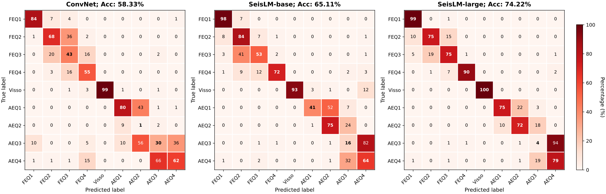
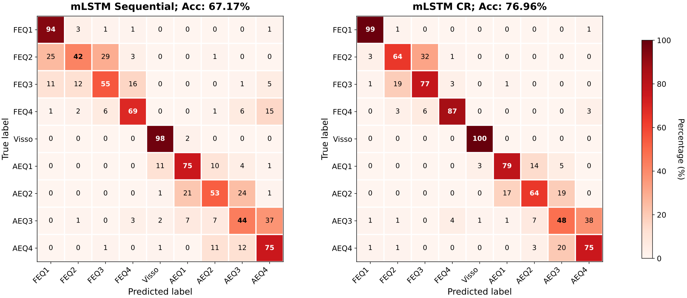
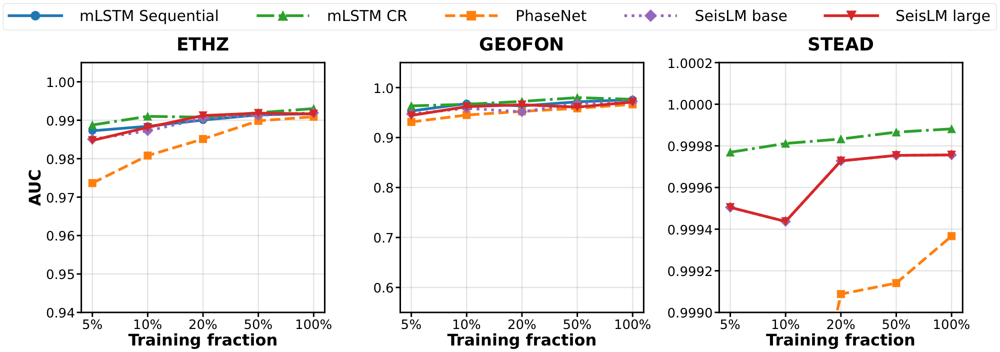
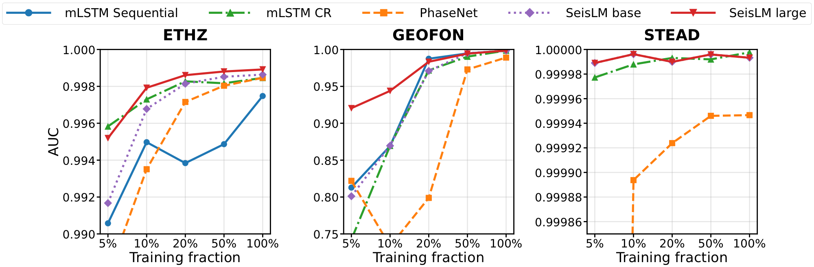
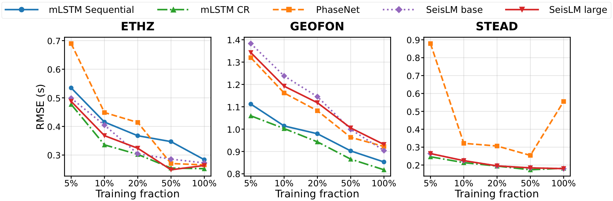
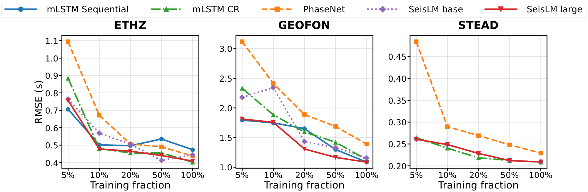
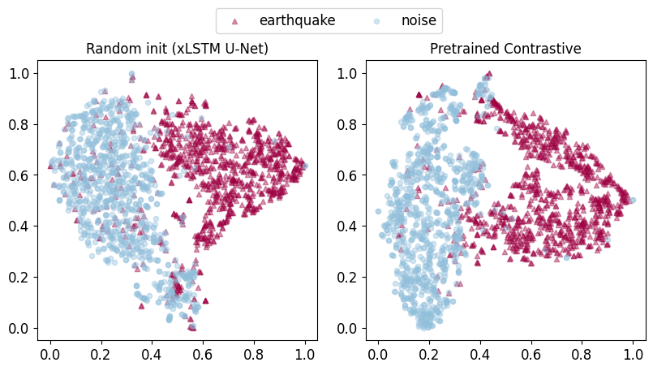
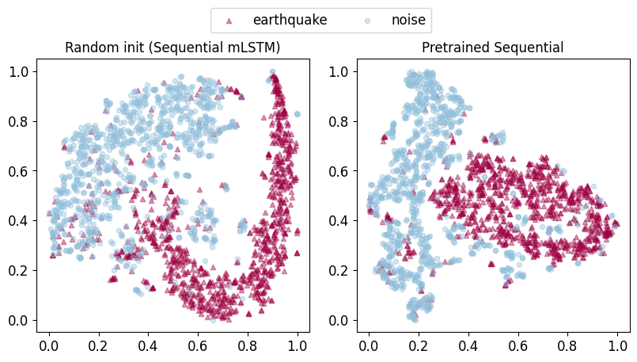

<div align="center">

# WaveXLSTM

### Extended LSTM for Self-Supervised Seismology

[](https://www.python.org/downloads/)
[](https://pytorch.org/)
[](https://lightning.ai/)

[**Getting Started**](#quick-start) | [**Architecture**](#architecture) | [**Experiments**](#experiments) | [**Results**](#results) | [**Citation**](#citation)

</div>

---

## What is WaveXLSTM?

**WaveXLSTM** applies Extended Long Short-Term Memory (xLSTM) to seismology, using a **U-Net architecture with mLSTM/sLSTM blocks** for self-supervised learning on seismic waveforms.

This repository accompanies the Master's thesis **“xLSTM in Seismology”** (University of Basel, **November 15, 2025**).

Building on the success of [SeisLM](https://github.com/liutianlin0121/seisLM) and inspired by [Wav2Vec 2.0](https://arxiv.org/abs/2006.11477), we pretrain on **millions of seismic waveform windows** from multiple datasets using contrastive learning with Gumbel-Softmax vector quantization. The pretrained model transfers effectively to downstream tasks including **phase picking** and **foreshock-aftershock classification**.

Key contributions:
- **xLSTM U-Net** combining bidirectional mLSTM blocks with skip connections for multi-scale temporal modeling
- **TFLA Triton kernels** enabling efficient mLSTM computation with linear memory scaling

---

## Key Features

### Architecture

- **xLSTM U-Net Backbone** with bidirectional mLSTM/sLSTM blocks and skip connections
- **Multi-scale pooling** (4096 → 1024 → 256 tokens) capturing both fine-grained arrivals and long-range structure
- **TFLA Triton kernels** for hardware-efficient mLSTM with BF16 mixed precision
- **Configurable scale**: 270K (supervised) to 20M (self-supervised) parameters

### Pretraining

**mLSTM-CR-large (Contrastive + VQ):**
- **8 datasets**: ETHZ, GEOFON, STEAD, INSTANCE, MLAAPDE, Iquique, PNW, OBST2024
- **Objective**: InfoNCE contrastive loss + Gumbel-Softmax VQ + diversity regularizer
- **Quantizer**: 2 groups × 320 codewords = 640 codes, ~510 perplexity (80% usage)
- **Key hyperparameters (thesis)**: `lr=1e-3`, cosine schedule with warmup; Gumbel temperature anneal `2.0 → 0.5`; span masking `p=0.65`, `mask_length=10`
- **Repo config starting point**: `configs/experiment/contrastive/xlstm_unet_seisbench.yaml`

**mLSTM-Seq-large (Masked Reconstruction):**
- **2 datasets**: STEAD + MLAAPDE (~2M waveforms)
- **Objective**: masked MSE (loss computed on masked spans only)
- **Key hyperparameters (thesis)**: `lr=2e-3`, cosine schedule with warmup; masking ratio `0.75`, span length `10`
- **Repo config starting point**: `configs/experiment/xlstm_large/pure_mlstm_sequential_12m_foundation.yaml`

### Downstream Tasks

| Task | Description | Classes |
|------|-------------|---------|
| **Phase Picking** | P/S wave arrival detection | Regression / 3-class |
| **Foreshock Classification** | Temporal classification relative to mainshock | 2 or 9 classes |

---

## Architecture

```
                             WaveXLSTM Architecture
    ┌─────────────────────────────────────────────────────────────────────┐
    │                                                                     │
    │   Input Waveform                                                    │
    │   [B, 4096, 3]                                                      │
    │        │                                                            │
    │        ▼                                                            │
    │   ┌─────────────┐                                                   │
    │   │ Conv Encoder│  Patch embedding (temporal convolutions)          │
    │   │   d=128     │                                                   │
    │   └──────┬──────┘                                                   │
    │          │                                                          │
    │          ▼                                                          │
    │   ┌─────────────────────────────────────────────────────────────┐   │
    │   │                    xLSTM U-Net Backbone                     │   │
    │   │                                                             │   │
    │   │  ┌───────────────┐                     ┌───────────────┐    │   │
    │   │  │ Encoder       │                     │ Decoder       │    │   │
    │   │  │               │                     │               │    │   │
    │   │  │ Stage 0       │─────────────────────│ Stage 0       │    │   │
    │   │  │ 4096 → 1024   │    Skip Connection  │ 1024 → 4096   │    │   │
    │   │  │ d=128         │                     │ d=128         │    │   │
    │   │  │ mLSTM ×3      │                     │ mLSTM ×3      │    │   │
    │   │  │               │                     │               │    │   │
    │   │  │ Stage 1       │─────────────────────│ Stage 1       │    │   │
    │   │  │ 1024 → 256    │    Skip Connection  │ 256 → 1024    │    │   │
    │   │  │ d=256         │                     │ d=256         │    │   │
    │   │  │ mLSTM ×3      │                     │ mLSTM ×3      │    │   │
    │   │  │               │                     │               │    │   │
    │   │  └───────┬───────┘                     └───────┬───────┘    │   │
    │   │          │                                     ▲            │   │
    │   │          ▼                                     │            │   │
    │   │     ┌─────────────────────────────────────────┐│            │   │
    │   │     │           Bottleneck (d=512)            ││            │   │
    │   │     │           256 tokens, mLSTM ×3          │┘            │   │
    │   │     └─────────────────────────────────────────┘             │   │
    │   │                                                             │   │
    │   └─────────────────────────────────────────────────────────────┘   │
    │          │                                                          │
    │          ▼                                                          │
    │   ┌─────────────┐                                                   │
    │   │  Task Head  │  (Classification / Regression / Contrastive)      │
    │   └──────┬──────┘                                                   │
    │          │                                                          │
    │          ▼                                                          │
    │      Output                                                         │
    │                                                                     │
    └─────────────────────────────────────────────────────────────────────┘
```

**Model Configurations:**

| Config | d_model | Layers | Parameters | Use Case |
|--------|---------|--------|------------|----------|
| Small (sLSTM/mLSTM) | 12-64 | 5×3 | ~270K | Supervised phase picking |
| mLSTM-CR-large | 128 | 5×3 | **20.3M** | Contrastive pretraining |
| mLSTM-Seq-large | 176 | 24 | **12.3M** | Masked reconstruction |

*Layer notation: 5×3 = 5 stages × 3 blocks per stage = 15 total blocks*

---

## Quick Start

### 1. Clone and Setup Environment

```bash
git clone https://github.com/UrfanAlvany/xlstm-seismic-foundation.git
cd xlstm-seismic-foundation

# Create conda environment
conda create -n wavexlstm python=3.10
conda activate wavexlstm

# Install PyTorch (CUDA 11.8 example)
pip install torch==2.1.0 torchvision torchaudio --index-url https://download.pytorch.org/whl/cu118

# Install dependencies
pip install pytorch-lightning hydra-core wandb seisbench
pip install einops triton
```

### 2. Install xLSTM with TFLA Kernels

```bash
# Install the official xLSTM library (required)
pip install xlstm

# Optional: install the TFLA/`mlstm_kernels` backend for faster mLSTM kernels.
# If it isn't installed, the code falls back to the pure-PyTorch backend automatically.
```

### 3. Download SeisBench Datasets

```python
import seisbench.data as sbd

# Download pretraining datasets (run once)
datasets = ['ethz', 'geofon', 'stead', 'instance', 'iquique', 'pnw']
for name in datasets:
    data = sbd.WaveformDataset(name, download=True)
```

### 4. Run Experiments

**Pretraining (Contrastive Learning):**
```bash
python simple_train.py experiment=contrastive/xlstm_unet_seisbench \
    trainer.devices=4 \
    trainer.max_epochs=50
```

**Fine-tune on Phase Picking:**
```bash
python simple_train.py experiment=phase_picking/fine_tune_xlstm_ethz_seislm \
    model.pretrained=/path/to/pretrained.ckpt \
    trainer.max_epochs=30
```

**Fine-tune on Foreshock Classification:**
```bash
export SEIS_DATA_DIR=/path/to/your/foreshock/data
python simple_train.py experiment=fore_aftershock/finetune_xlstm_unet \
    model.pretrained=/path/to/pretrained.ckpt \
    trainer.max_epochs=15
```

---

## Project Structure

```
xlstm-seismic-foundation/
├── simple_train.py              # Main training script (PyTorch Lightning)
├── configs/
│   ├── experiment/              # Experiment configurations
│   │   ├── contrastive/         # Pretraining configs
│   │   ├── phase_picking/       # Phase picking fine-tuning
│   │   ├── fore_aftershock/     # Foreshock classification
│   │   └── xlstm_large/         # Large-scale foundation models
│   ├── model/                   # Model architecture configs
│   ├── dataset/                 # Dataset configurations
│   ├── optimizer/               # Optimizer configs (AdamW, etc.)
│   └── scheduler/               # LR scheduler configs
├── models/
│   ├── xlstm_unet.py            # xLSTM U-Net backbone (core architecture)
│   ├── contrastive_wrapper.py   # Wav2Vec 2.0-style contrastive wrapper
│   └── quantizers.py            # Gumbel-Softmax vector quantization
├── dataloaders/
│   ├── seisbench_loader.py      # SeisBench dataset loaders
│   └── foreshock_loader.py      # Foreshock-aftershock data pipeline
├── tasks/
│   ├── encoders/                # Input encoders (convolutional, etc.)
│   ├── decoders/                # Task-specific heads
│   └── losses/                  # Loss functions (InfoNCE, etc.)
├── evaluation/                  # Evaluation scripts and metrics
└── notebooks/                   # Analysis notebooks
```

---

## Experiments

### Configuration Reference

| Task | Config Path | Description |
|------|-------------|-------------|
| **Pretraining** | | |
| Contrastive + VQ | `contrastive/xlstm_unet_seisbench` | mLSTM U-Net + VQ, 8 datasets |
| Masked reconstruction | `xlstm_large/pure_mlstm_sequential_12m_foundation` | sequential mLSTM + upsampling decoder |
| **Phase Picking** | | |
| ETHZ | `phase_picking/fine_tune_xlstm_ethz_seislm` | P/S arrival detection |
| GEOFON | `phase_picking/fine_tune_xlstm_geofon_seislm` | P/S arrival detection |
| STEAD | `phase_picking/fine_tune_xlstm_stead_seislm` | P/S arrival detection |
| **Foreshock Classification** | | |
| xLSTM U-Net | `fore_aftershock/finetune_xlstm_unet` | 9-class temporal classification |
| Pure mLSTM variants | `fore_aftershock/finetune_pure_mlstm_*` | Multiple configurations |

### Training Commands

```bash
# Pretraining with multi-GPU
python simple_train.py experiment=contrastive/xlstm_unet_seisbench \
    trainer.devices=4 \
    trainer.strategy=ddp \
    loader.batch_size=64

# Foreshock classification
python simple_train.py experiment=fore_aftershock/finetune_xlstm_unet \
    model.pretrained=/path/to/pretrained.ckpt \
    dataset.data_dir=${SEIS_DATA_DIR}

# Debug run (fast iteration)
python simple_train.py experiment=fore_aftershock/finetune_xlstm_unet \
    trainer.fast_dev_run=True
```

---

## Results

### Highlights (as reported in the thesis + `results/`)

**Foreshock–aftershock classification (Norcia 2016, 9 classes):**
- **mLSTM-CR-large: 76.96%** accuracy
- SeisLM-large: 74.22% accuracy
- Improvement: **+2.74 pp** with far fewer parameters (~20M vs ~94M)




**Phase picking benchmark transfer (ETHZ / GEOFON / STEAD):** (full curves in Figs. 5.4–5.7)

| Dataset @ 100% labels | Best event AUC | Best phase AUC | Best P RMSE (s) | Best S RMSE (s) |
|---|---:|---:|---:|---:|
| ETHZ | **mLSTM-CR** 0.993029 | **SeisLM-large** 0.998918 | **mLSTM-CR** 0.252285 | **mLSTM-CR** 0.402183 |
| GEOFON | **mLSTM-CR** 0.976484 | **SeisLM-large** 0.998553 | **mLSTM-CR** 0.817993 | **SeisLM-large** 1.084812 |
| STEAD | **mLSTM-CR** 0.999882 | **mLSTM-CR** 0.999998 | **SeisLM-base/large** 0.179878 | **mLSTM-CR** 0.208388 |

<details>
<summary>Show Figures 5.4–5.7 (phase picking transfer curves)</summary>






</details>

### Supervised small-model benchmark (Table 5.1)

These results are from training **small xLSTM models from scratch** (no pretraining) under the SeisBench benchmark protocol.

| Dataset | Metric | PhaseNet (PN) | EQTransformer (EQT) | S4D | Mamba | Hydra | sLSTM-small | mLSTM-small | xLSTM-small[2:1] |
|---|---|---:|---:|---:|---:|---:|---:|---:|---:|
| ETHZ | Event AUC ↑ | 0.990 | 0.960 | 0.990 | 0.993 | 0.992 | 0.992 | 0.993 | 0.993 |
| ETHZ | Phase AUC ↑ | 0.998 | 0.998 | 0.998 | 0.999 | 0.998 | 0.998 | 0.999 | 0.998 |
| ETHZ | P-onset RMSE (s) ↓ | 0.297 | 0.355 | 0.267 | 0.230 | 0.279 | 0.214 | 0.228 | 0.242 |
| ETHZ | S-onset RMSE (s) ↓ | 0.467 | 0.519 | 0.439 | 0.424 | 0.459 | 0.465 | 0.425 | 0.657 |
| GEOFON | Event AUC ↑ | 0.964 | 0.986 | 0.979 | 0.977 | 0.977 | 0.974 | 0.975 | 0.979 |
| GEOFON | Phase AUC ↑ | 0.988 | 0.994 | 0.996 | 0.994 | 0.995 | 0.994 | 0.990 | 0.996 |
| GEOFON | P-onset RMSE (s) ↓ | 0.929 | 0.962 | 0.849 | 0.876 | 0.843 | 0.873 | 0.895 | 0.856 |
| GEOFON | S-onset RMSE (s) ↓ | 1.481 | 1.401 | 1.285 | 1.366 | 1.354 | 1.406 | 1.369 | 1.263 |
| STEAD | Event AUC ↑ | 1.000 | 1.000 | 1.000 | 1.000 | 1.000 | 1.000 | 1.000 | 1.000 |
| STEAD | Phase AUC ↑ | 1.000 | 1.000 | 1.000 | 1.000 | 1.000 | 1.000 | 1.000 | 1.000 |
| STEAD | P-onset RMSE (s) ↓ | 0.167 | 0.188 | 0.166 | 0.184 | 0.193 | 0.198 | 0.204 | 0.196 |
| STEAD | S-onset RMSE (s) ↓ | 0.215 | 0.230 | 0.206 | 0.207 | 0.208 | 0.212 | 0.210 | 0.209 |

### Pretraining diagnostics (Figs. 5.1–5.3)

<details>
<summary>Show Figures 5.1–5.3 (stability + t-SNE)</summary>





</details>

### Where the numbers come from

- Phase-picking transfer curves/tables: `results/phase_picking_all_results_comprehensive.csv`
- Foreshock accuracy + confusion matrices: `results/foreshock_experiments_comparison.json`
- Thesis figure exports used in this README: `figures/thesis/`

---

## Citation

If you use WaveXLSTM in your research, please cite:

```bibtex
@mastersthesis{wavexlstm2025,
  title     = {WaveXLSTM: Extended LSTM for Self-Supervised Seismology},
  author    = {Alvani, Urfan},
  school    = {University of Basel},
  year      = {2025},
  note      = {Master's Thesis}
}
```

Please also cite the foundational works:

```bibtex
@article{beck2024xlstm,
  title   = {xLSTM: Extended Long Short-Term Memory},
  author  = {Beck, Maximilian and P{\"o}ppel, Korbinian and Spanring, Markus and others},
  journal = {arXiv preprint arXiv:2405.04517},
  year    = {2024}
}

@article{seislm2024,
  title   = {SeisLM: a Foundation Model for Seismic Waveforms},
  author  = {Münchmeyer, Jannes and others},
  journal = {arXiv preprint},
  year    = {2024}
}

@inproceedings{woollam2022seisbench,
  title     = {SeisBench: A Toolbox for Machine Learning in Seismology},
  author    = {Woollam, Jack and others},
  booktitle = {Seismological Research Letters},
  year      = {2022}
}
```

---

## Acknowledgments

### Supervision

- **Till Muser** — PhD Candidate, University of Basel (UniBas) — Master's thesis supervisor

### Upstream code & licenses

This repository depends on and/or was implemented using the following open-source projects. Please make sure you comply with their licenses when redistributing code or trained artifacts (license metadata checked via GitHub API on 2026-02-05):

- **[SeisBench](https://github.com/seisbench/seisbench)** — GNU GPL v3.0
- **[xLSTM](https://github.com/NX-AI/xlstm)** — Apache License 2.0
- **[`mlstm_kernels`](https://github.com/NX-AI/mlstm_kernels)** — license classified by GitHub as “Other” (verify in the upstream repo); optional performance backend only (not vendored here)
- **[TFLA](https://github.com/NX-AI/tfla)** — no license detected via GitHub API at time of writing; optional performance backend only (not vendored here)
- **[SeisLM](https://github.com/liutianlin0121/seisLM)** — no license detected via GitHub API at time of writing; referenced as a baseline/related work (no code vendored here)

### Tools and libraries

This project builds on excellent open-source work:

- **[PyTorch Lightning](https://lightning.ai/)** - Training framework
- **[Hydra](https://hydra.cc/)** - Configuration management
- **[Weights & Biases](https://wandb.ai/)** - Experiment tracking

---

<div align="center">

**[Back to Top](#wavexlstm)**

</div>
